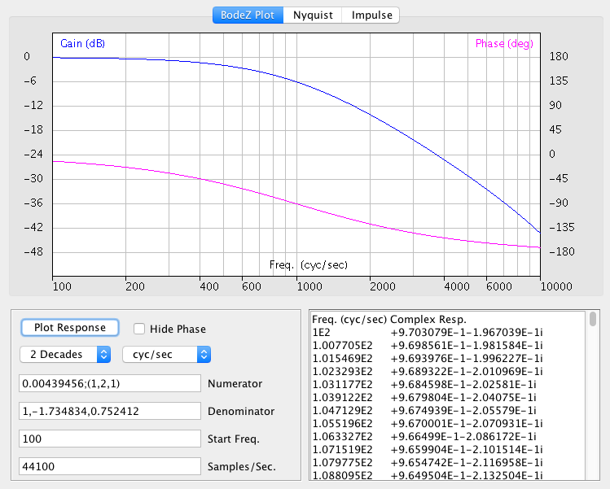

# How to Build BodeZ

The BodeZ Java app can be built from source code, either in your favorite IDE or at the command line. I've had good success with both Eclipse (on Windows, Mac, and Linux) and Geany (on Linux). If building on the command line, first be sure you have a Java compiler and run-time installed. The current version of BodeZ is over ten years old, so when compiling you'll get some warnings about obsolete operations, but will still create the class files. Following example is of downloading the project, and building and running BodeZ in a MacOS terminal window. This process works the same way in Windows and Linux as well.

```
MarksiMac:Projects williamm$ git clone https://github.com/springleik/BodeZ.git
Cloning into 'BodeZ'...
remote: Enumerating objects: 30, done.
remote: Counting objects: 100% (30/30), done.
remote: Compressing objects: 100% (27/27), done.
remote: Total 30 (delta 6), reused 4 (delta 0), pack-reused 0 (from 0)
Receiving objects: 100% (30/30), 79.36 KiB | 3.61 MiB/s, done.
Resolving deltas: 100% (6/6), done.

MarksiMac:Projects williamm$ cd BodeZ

MarksiMac:BodeZ williamm$ javac BodeZ.java
Note: BodeZ.java uses unchecked or unsafe operations.
Note: Recompile with -Xlint:unchecked for details.

MarksiMac:BodeZ williamm$ java BodeZ
usage: java -cp BodeZ.jar BodeZ numCoeff [denCoeff [startFreq [2|3|4 [units [sampRate]]]]]
Z-Domain Bode/Nyquist Plot v. 1.0.1;  M. Williamsen 12/23/2014
>>Numerator: 0.004395, 0.008789, 0.004395
Denominator: 1, -1.734834, 0.752412
Start freq.: 100.0 cyc/sec
Sample rate: 44100.0 samp/sec
MarksiMac:BodeZ williamm$
```

In looking over this output I noticed that the usage text mentions a jar file which doesn't actually exist. Just type "java BodeZ" and the app should run and open a new window like this:



With no arguments on the command line the app defaults to a first-order low-pass filter with cut-off frequency at 1 kHz. Gain is 6 dB down and phase is -90 degrees at 1 kHz.
