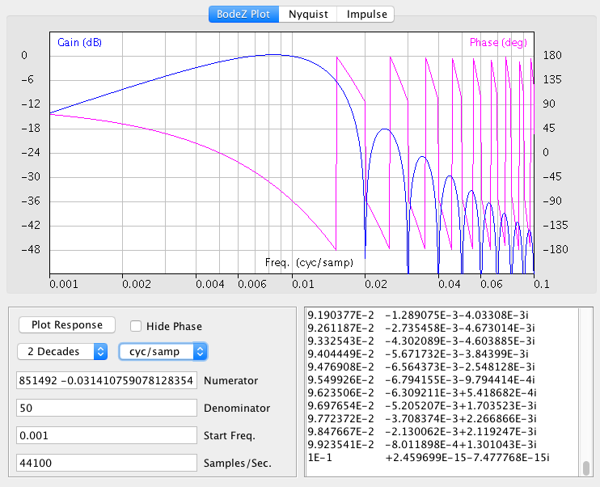
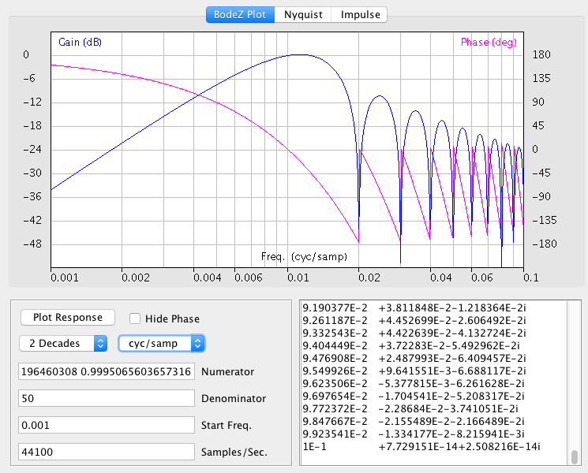

# Using BodeZ to Plot a Matched Filter

The BodeZ Java app in this repo was used to obtain Figure 5 in my paper "Digitizing Bridge Measures RC Time Constants," IEEE Transactions on Instrumentation and Measurement, vol. 75, doi: [10.1109/TIM.2026.3670597](https://ieeexplore.ieee.org/document/11421509#:~:text=10.1109/TIM.2026.3670597). The figure shows two Bode plots of the gain and phase response of sine and cosine inner product matched filters, cast as finite impulse response (FIR) filters in the Z domain. Follow these steps to recreate the same plots:

- Build and run the Java app BodeZ. <[How to Build BodeZ](HowToBuild.md)>
- Obtain 100 samples representing a single cycle of a sine wave, offset by one half sample so the waveform is antisymmetric about its center. This is easily done by running the following command line in a terminal window.
```
python3 -c "import math; print(*(math.sin((x+0.5)/50 * math.pi) for x in range (0,100)), sep ='\n')"
```
- Copy and paste all 100 samples from the terminal window into the "Numerator" field of the BodeZ app, replacing previous contents. These samples become the weights in a multiply-and-accumulate (MAC) operation implementing a matched filter.
- Enter the number 50 into the "Denominator" field, replacing previous contents. This normalizes gain to unity at the center frequency.
- Set the "Start Freq." field to 0.001
- Set the units control to "cyc/samp" (and _not_ "cyc/sec")
- Click the "Plot Response" button to redraw the image.



You should now see the sine matched filter response, hitting unity gain (0 dB) at 0.01 cycles/sample, with deep notches at all harmonics, and a slope on the left falling off at 6 dB/octave.

- Now obtain 100 samples representing a single cycle of a cosine wave, offset by one half sample so the waveform is symmetric about its center. This is easily done by running the following command line in a terminal window:
```
python3 -c "import math; print(*(math.cos((x+0.5)/50 * math.pi) for x in range (0,100)), sep ='\n')"
```
- Copy and paste all 100 samples from the terminal window into the "Numerator" field of the BodeZ app, replacing previous contents.
- Click the "Plot Response" button to redraw the image, with other settings as before.



The cosine matched filter response also hits unity gain (0 dB) at 0.01 cycles/sample, and has deep notches at all harmonics. The difference is that now the slope on the left falls off at 12 dB/octave. It's ok to run two copies of the BodeZ app, to compare the two filters side-by-side. Just be sure to populate all fields in both copies.
