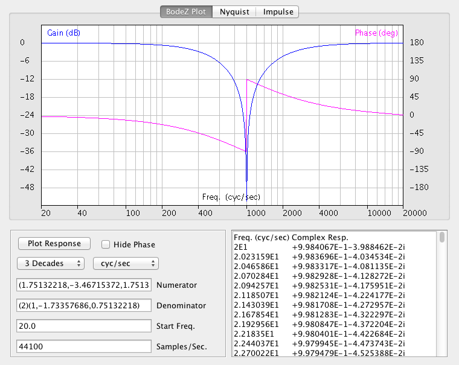

# BodeZ
Z-domain Bode plot applet, as described at http://www.williamsonic.com/BodeNyquist/BodeZ.html



BodeZ was originally written to be both an application program and an applet, but applets are now deprecated so the best way to launch this is as an application at the command line.  The simplest command line in a DOS Box window would look like this, where the current working directory contains the compiled class files:

```
C:\Java Projects\BodeZ>java BodeZ
usage: java BodeZ numCoeff [denCoeff [startFreq [2|3|4 [units [sampRate]]]]]
Z-Domain Bode/Nyquist Plot v. 1.0.1;  M. Williamsen 12/23/2014
>>Numerator: 0.004395, 0.008789, 0.004395
Denominator: 1, -1.734834, 0.752412
Start freq.: 100.0 cyc/sec
Sample rate: 44100.0 samp/sec
```

Six optional positional arguments may be used to set BodeZ parameters on opening:

* **Numerator Coefficients**  Transfer function coefficients for the polynomial in the numerator, representing a sum in powers of the discrete time variable _z_. To simplify parsing this argument, you just enter the coefficients in order from highest order to lowest, always beginning with the zeroth order coefficient on the left. Trailing zeros are optional, leading zeros aren't. Coefficients are separated with commas, noting that consecutive commas count as one.
* **Denominator Coefficients**  Transfer function coefficients for the polynomial in the denominator. If several polynomials are to be multiplied to form the numerator or denominator, enclose each set of coefficients within parentheses. As a shortcut you can use a semicolon ';' to separate polynomials instead of parentheses. Operation of nested parentheses is not defined. All coefficients are real numbers which may be entered as decimal values (1.234) or using scientific notation (1.23e4).
* **Start Frequency**  Real-valued number giving the frequency at the left edge of the horizontal axis.
* **Number of Decades to Plot**  Decades of frequency in the horizontal axis.  May be either _2_, _3_, or _4_.
* **Units for Horizontal Axis**  Frequency units in the horizontal axis may be _rad/samp_, _cyc/samp_, _rad/sec_, or _cyc/sec_.
* **Sample Rate** Sample rate in units of samples/second.

A typical example using all six optional arguments might look like this:

```
C:\Java Projects\BodeZ>java BodeZ (1.75132218)(1,-1.979734945,1) (2)(1,-1.73357686,0.75132218) 20.0 3 cyc/sec 44100
Z-Domain Bode/Nyquist Plot v. 1.0.1;  M. Williamsen 12/23/2014
>>Numerator: 1.751322, -3.467154, 1.751322
Denominator: 2, -3.467154, 1.502644
Start freq.: 20.0 cyc/sec
Sample rate: 44100.0 samp/sec
```
